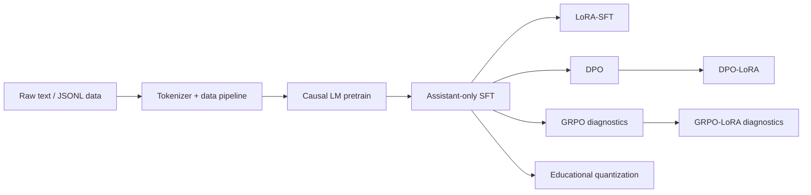
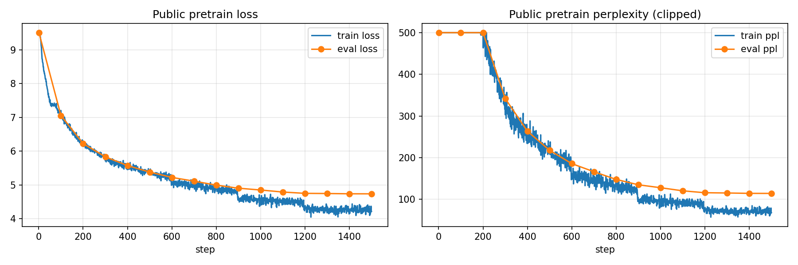
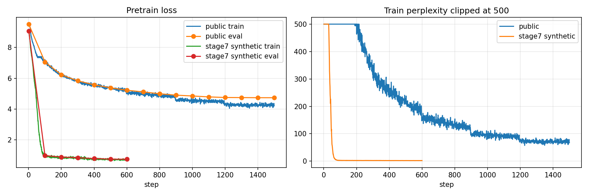
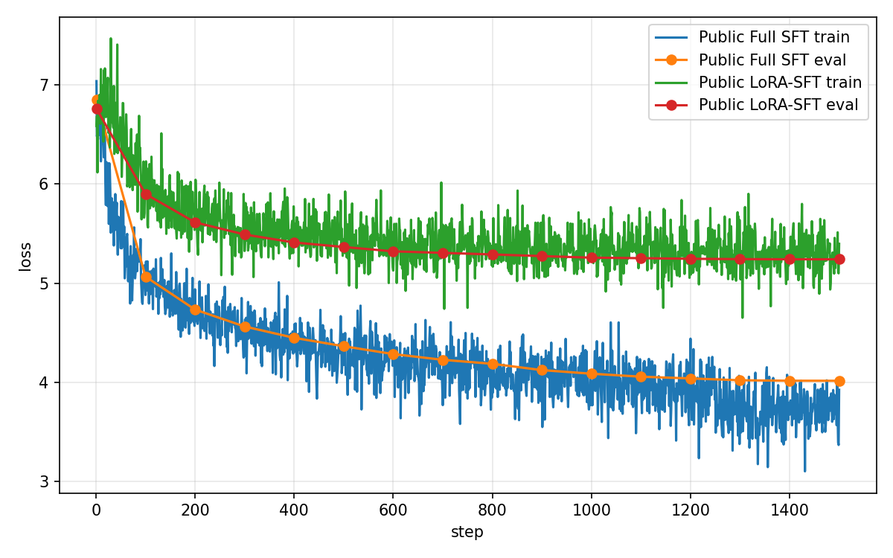
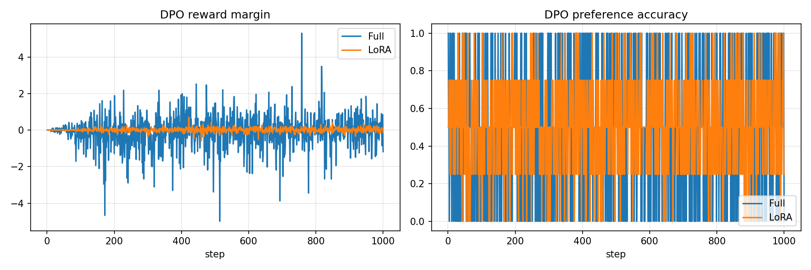
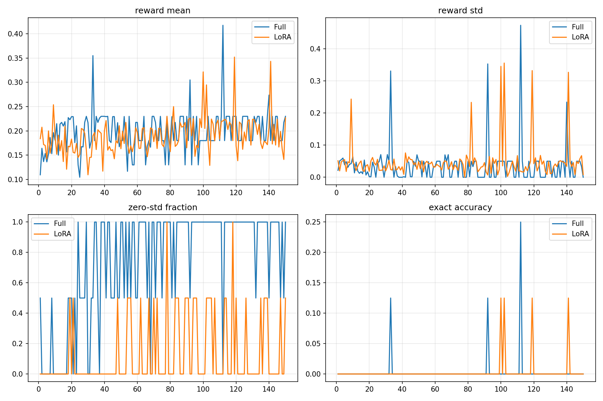

# MiniMind: From-Scratch Mini-LLM Training Stack

MiniMind is an educational mini-LLM project that rebuilds the core training and post-training workflow from scratch: tokenizer and data pipeline, decoder-only Causal LM, pretraining, assistant-only SFT, LoRA, DPO, GRPO-style diagnostics, and educational quantization.

The goal is not to train a strong model. The goal is to make the mechanics of a modern LLM stack inspectable, testable, and reproducible on a single local GPU.

## What This Project Implements

- Byte-level BPE tokenizer training, loading, encoding, decoding, and block packing.
- Decoder-only Causal LM with GQA, RoPE, SwiGLU MLP, RMSNorm, tied embeddings, causal loss, and generation.
- Custom pretraining loop with checkpointing, resume, scheduler, gradient clipping, TensorBoard/JSONL metrics, and plots.
- Assistant-only SFT data masking and full-parameter SFT.
- Self-implemented LoRA adapters for SFT, DPO, and GRPO diagnostic runs.
- DPO from scratch with frozen reference model, sequence log probabilities, reward margin, and preference accuracy.
- GRPO-style online sampling diagnostics with rule rewards, group-relative advantages, and clipped policy loss.
- Educational INT8/INT4 fake quantization, simplified GPTQ-style quantization, and SmoothQuant-style wrappers.
- Audit reports for every stage so results are traceable instead of hand-waved.



## Public-Data Long Run

After validating the stack on local synthetic data, Stage 8 reran the same pipeline on public dataset subsets. These runs are more credible than the synthetic runs because the data is less templated and the metrics do not saturate trivially.

| Component | Data | Run | Result |
| --- | --- | --- | --- |
| Pretrain | WikiText-2 raw | 45.63M params, 1,500 steps | eval loss `9.5070 -> 4.7385`, eval ppl `13453.52 -> 114.27` |
| Full SFT | Alpaca | 1,500 steps | eval loss `6.8521 -> 4.0156`, eval ppl `945.84 -> 55.46` |
| LoRA-SFT | Alpaca | q/v LoRA, 0.67% trainable | eval loss `6.7604 -> 5.2418`, eval ppl `862.95 -> 189.02` |
| Full DPO | AlpacaFarm GPT-4 preference | 1,000 steps | final eval margin `0.1615`, preference accuracy `0.5500` |
| DPO-LoRA | AlpacaFarm GPT-4 preference | 0.67% trainable | final eval margin `0.0582`, preference accuracy `0.5250` |
| GRPO diagnostics | Local verifiable rewards | 150 steps | exact accuracy stayed `0`; zero-std diagnostics exposed weak reward diversity |

Public-data details:

- Pretrain: `Salesforce/wikitext`, `wikitext-2-raw-v1`, 16,929 lines, 10.7 MB.
- Tokenizer: Byte-level BPE, vocab size 12,000.
- Tokenization: 2,495,217 tokens, 9,552 train blocks, 194 val blocks, block size 256.
- SFT: `tatsu-lab/alpaca`, 20,000 train examples and 2,000 validation examples.
- DPO: `tatsu-lab/alpaca_farm`, 10,000 train preference pairs and 1,000 validation pairs.
- GRPO: local verifiable reward prompts by design, not public RLVR.

## Key Plots











## Full Fine-Tuning vs LoRA

The project keeps full-parameter training and LoRA training side by side so the engineering tradeoff is visible.

| Run | Total params | Trainable params | Trainable ratio | Public-data observation |
| --- | ---: | ---: | ---: | --- |
| Full SFT | 45,631,296 | 45,631,296 | 100% | Lower public SFT eval loss than LoRA in this run |
| LoRA-SFT | 45,938,496 | 307,200 | 0.6687% | Much cheaper update path, higher eval loss |
| Full DPO | 45,631,296 | 45,631,296 | 100% | Preference accuracy stayed modest at `0.55` |
| DPO-LoRA | 45,938,496 | 307,200 | 0.6687% | Similar diagnostic behavior with far fewer trainable params |

This is a parameter-efficiency demonstration, not evidence that the tiny model has robust instruction-following behavior.

## DPO And GRPO Diagnostics

DPO is implemented from scratch using chosen/rejected sequence log probabilities and a frozen reference model. On synthetic data, DPO accuracy quickly saturated to `1.0`. On public AlpacaFarm preference data, it stayed near `0.55`, which is a more honest diagnostic signal.

GRPO is implemented as a minimal RL post-training loop: online sampling, rule rewards, group-relative advantage, and a token-level clipped objective. The public-policy diagnostic run did not improve exact-answer accuracy. Full GRPO collapsed to zero group reward standard deviation by the end, while LoRA-GRPO retained some diversity but still did not solve the reward task.

## Educational Quantization

Stage 6 implements fake-quantization experiments for learning and measurement:

| Method | Loss delta | Estimated compression | Important caveat |
| --- | ---: | ---: | --- |
| INT8 weight-only | `+0.000553` | `1.97x` | fake quant, dequantizes before `F.linear` |
| INT4 weight-only | `+0.240660` | `2.60x` | int4 values stored without bit packing |
| GPTQ-style INT4 | `+0.240660` | `2.60x` | simplified GPTQ-style error reporting, no full compensation |
| SmoothQuant-style INT8 | `+0.000723` | `1.95x` | educational wrapper, not fused deployment graph |

These results should not be described as production inference acceleration.

## Repository Map

- `minillm/`: model, tokenizer, data loaders, trainers, LoRA, DPO, GRPO, and quantization code.
- `scripts/`: dataset creation/download, training entrypoints, evaluation, plotting, and audit helpers.
- `configs/`: reproducible YAML configs for smoke runs, synthetic long runs, and public-data runs.
- `tests/`: CPU-friendly unit and smoke tests for model/data/training components.
- `audit_stage*/`: stage-by-stage audit reports.
- `outputs/`: generated metrics, checkpoints, samples, and plots.
- `docs/`: longer design notes, experiment summaries, limitations, and interview notes.

## Reproduce The Main Public Run

The local audited environment was:

```powershell
D:\anaconda3\envs\YSJAirCombat\python.exe
```

Representative commands:

```bash
python scripts/stage8_training_preflight.py
python scripts/train_pretrain.py --config configs/stage8_public/pretrain_public_long.yaml
python scripts/train_sft.py --config configs/stage8_public/sft_public_full.yaml
python scripts/train_sft.py --config configs/stage8_public/sft_public_lora.yaml
python scripts/train_dpo.py --config configs/stage8_public/dpo_public_full.yaml
python scripts/train_dpo.py --config configs/stage8_public/dpo_public_lora.yaml
```

Run tests:

```bash
python -m pytest -q
```

## More Documentation

- [Training stack](docs/training_stack.md)
- [Experiment results](docs/experiment_results.md)
- [Limitations](docs/limitations.md)
- [Interview notes](docs/interview_notes.md)
- [Artifact policy](docs/artifact_policy.md)
- [Data sources](docs/data_sources.md)
- [Model card](docs/model_card.md)
- [Release checklist](docs/release_checklist.md)
- [Stage 8 public final audit](audit_stage8/stage8_public_final_report.md)
- [Stage 7 synthetic long-run summary](audit_stage7/stage7_interview_summary.md)

## Limitations

This project demonstrates the engineering stack and training diagnostics of a mini-LLM. It does not claim real instruction following, alignment, mathematical reasoning, or production deployment performance. The model is small, the public datasets are subsets, the training budgets are limited, GRPO rewards are local rule-based diagnostics, and quantization is educational fake quantization.
