# Stage 7 Interview Summary

## 1. One-Sentence Project Intro

I implemented a from-scratch mini-LLM training and post-training stack covering tokenizer/data pipeline, decoder-only Causal LM, pretraining, SFT, LoRA, DPO, GRPO, and educational quantization, with reproducible configs, metrics, checkpoints, plots, and audit reports.

## 2. Technical Pipeline

```mermaid
flowchart LR
  Data --> Tokenizer --> Pretrain --> SFT
  SFT --> LoRA_SFT[LoRA-SFT]
  SFT --> DPO
  DPO --> DPO_LoRA[DPO-LoRA]
  SFT --> GRPO
  GRPO --> GRPO_LoRA[GRPO-LoRA]
  SFT --> Quant[Educational Quantization]
```

## 3. What Each Stage Did

- Stage 0.5: audited the fixed YSJAirCombat Python/CUDA environment.
- Stage 1: built the decoder-only Causal LM with RMSNorm, RoPE, GQA, SwiGLU, and generation.
- Stage 2: built tokenizer, block data pipeline, pretrain loop, checkpoints, metrics, and plots.
- Stage 3: built assistant-only SFT and self-implemented LoRA.
- Stage 4: built DPO and DPO-LoRA from scratch with frozen reference model.
- Stage 5: built GRPO-style online sampling, rule rewards, group-relative advantage, and clipped policy loss.
- Stage 6: built educational weight-only INT8/INT4, GPTQ-style, and SmoothQuant-style fake quantization.
- Stage 7: ran longer resume-ready experiments and collected README/interview plots.

## 4. Key Curves

- Pretrain loss/PPL: `outputs/stage7/plots/pretrain_loss_ppl.png`
- SFT full vs LoRA: `outputs/stage7/plots/sft_full_vs_lora_loss.png`
- DPO margin/accuracy: `outputs/stage7/plots/dpo_full_vs_lora_margin_acc.png`
- GRPO reward diagnostics: `outputs/stage7/plots/grpo_reward_diagnostics.png`

## 5. Full vs LoRA Comparison

Full fine-tuning updates all parameters and is a useful upper-bound engineering baseline. LoRA updates a small adapter subset, making training cheaper while preserving the same training loop surface and checkpoint/adapter workflow.

## 6. DPO Metrics Explained

DPO loss optimizes the relative log probability of chosen over rejected responses against a frozen reference. Reward margin tracks how much more the policy favors chosen outputs, and preference accuracy measures how often chosen reward exceeds rejected reward.

## 7. GRPO Diagnostics Explained

GRPO samples multiple completions per prompt. Reward std matters because group-relative advantage disappears when all completions get the same reward. A high zero-std fraction is a warning that the reward or sampling setup is not giving useful learning signal.

## 8. Quantization Results Explained

INT8 fake quant preserved loss almost exactly, INT4 degraded loss more, GPTQ-style recorded activation-weighted errors without full compensation, and SmoothQuant-style used a runtime scaling wrapper. These are educational fake-quant experiments, not production integer-kernel speedups.

## 9. Limitations

- Local synthetic data is not comparable to real pretraining or RLHF/RLVR corpora.
- The model is small and should not be presented as generally capable.
- GRPO reward functions are rule-based and sparse/dense toy signals.
- Quantization lacks bit packing and real integer kernels.

## 10. Interview Version

I can walk through the whole LLM lifecycle end to end: how text becomes tokens, how a decoder-only transformer is trained, how SFT masks assistant tokens, how LoRA reduces trainable parameters, how DPO uses a frozen reference model, why GRPO needs reward variance, and why fake quantization can reduce estimated size without guaranteeing latency improvements.
